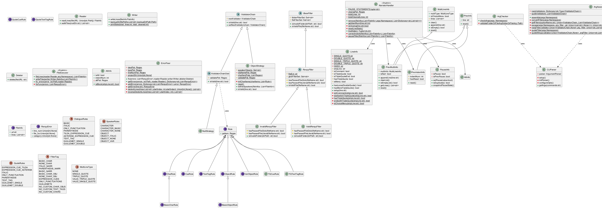

<div align="center">
  <h1>No Narrate</h1>
  <p>A tool for removing narration and thoughts from Ren'Py visual novel games.</p>
</div>

## Idea

A story should unfold *organically*. Let the characters' **actions**,
the **environment**, and active **scenarios** carry the
narrative, without the need of inner voices or overt explanations for what can
already be inferred and *seen*. Players are *encouraged* to
draw their own interpretations of the events unfolding.

## Types of Narration

There are 2 sectors to identify narration in Ren'Py:

- *Character/Speaker*
- *Dialogue*

  ### Ren'Py Narrator Example

  

## Requirements

- Python 3.12+
- Ren'Py game with *.rpy* files

## Installation

There are multiple ways to install/upgrade.

### From GitHub

```bash
python -m pip install "nonarrate @ git+https://github.com/Edexaal/nonarrate.git"
```

### From Source Code

```bash
git clone https://github.com/Edexaal/nonarrate.git && cd nonarrate
python -m pip install .
```

**To Uninstall**:

```bash
python -m pip uninstall nonarrate
```

## Usage

To use *nonarrate* check out [COMMANDS.md](./COMMANDS.md)!

## Project Structure



## License

**nonarrate** is subject under the [Unlicense](./UNLICENSE) license.
